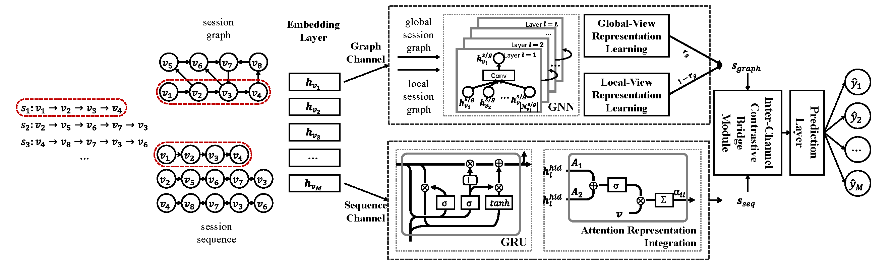

# DC-Rec

This Is the Official Implementation for Our Paper:
> Xinglong Wu, Hui He, Zejun Wang, Yu Tai, Sheng Yin, Hongwei Yang, and Weizhe Zhang. "How to Bridge Graph and Sequence Patterns in Session-based Recommendation? A Self-Supervised Method." 2024 IEEE International Conference on Acoustics, Speech and Signal Processing (ICASSP 2024). IEEE, 2024, pp. 7805-7809.

## Overview

We propose **DC-Rec** (**D**ual-**C**hannel Framework for **Rec**ommendation), a contrastive bridge framework between sequential and structural patterns for session-based recommendations.

## Introduction

**Appendix.pdf** is the Appendix of our paper.

dataset folder contains NowPlaying and YooChoose datasets.
